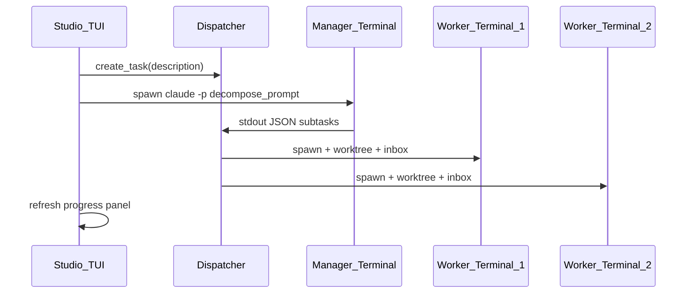

# Phase 1.5 终端 UX 设计

**日期：** 2026-06-07  
**状态：** 已批准  
**前置：** [Phase 1 最小闭环](2026-06-07-local-multi-agent-platform-design.md)  
**关联：** [AGENTS.md](../../../AGENTS.md)

---

## 1. 目标

Studio 不再只是「打命令写 YAML」，而是提供 **与 Hermes/Claude 同档次的终端指挥舱**：

1. 用户输入项目描述 → **美观向导**列出推荐岗位与选项
2. 用户确认 → **自动弹出主管 Agent 终端**执行拆解
3. 主管完成 → **自动弹出下属 Agent 终端**在 Worktree 中并行工作
4. Studio 主界面保持 **实时状态面板**（组织树、进度、blocked）

**原则：** Studio 做「CEO 控制台」；Agent 原生 UI 做「员工车间」。两层都应在终端里体验良好。

---

## 2. 双终端模型

```
┌─ Studio 指挥舱 (Textual TUI，常驻) ─────────────────┐
│  Header: IntAgent Studio · 项目 demo · Supervisor ✓  │
│  ┌─组织树─┐  ┌─任务/进度──────────────────────────┐  │
│  │ 老王   │  │ 搜索框功能  pending → assigned …   │  │
│  │ ├小红  │  │ 小红 ████████░░ 80%                │  │
│  │ ├大壮  │  │ 大壮 ██████████ done                 │  │
│  │ └小严  │  │ 小严 ░░░ blocked                     │  │
│  └────────┘  └─────────────────────────────────────┘  │
│  [N] 新任务  [S] 刷新  [R] 审批  [Q] 退出              │
└───────────────────────┬─────────────────────────────┘
                        │ spawn
        ┌───────────────┼───────────────┐
        ▼               ▼               ▼
   新窗口: 老王      新窗口: 小红      新窗口: 大壮
   claude -p …      cursor --task …  hermes chat -q …
```

| 窗口 | 技术 | 职责 |
|---|---|---|
| Studio 主 TUI | Textual + Rich | 向导、选项、组织树、进度、CEO 审批 |
| Agent 工作终端 | 系统新窗口 + subprocess | 各 Agent 原生 CLI 界面 |

---

## 3. 技术选型

| 组件 | 选型 | 理由 |
|---|---|---|
| Studio 主 TUI | **Textual 0.x** | 全屏面板、树、键盘导航、Live 刷新 |
| 向导步骤/列表 | **questionary**（TUI 内嵌调用）或 Textual Select | AGENTS.md 数字选择交互；样式统一用 Rich |
| 样式 | **Rich** Theme | 边框、表格、进度条、Markdown 渲染 |
| 多终端 spawn | **core/terminal/spawner.py** | Windows: `wt.exe` 新标签 > `Start-Process cmd /k` |
| Agent 执行 | 现有 `agents/` 适配层 | subprocess 命令构建不变 |
| 状态轮询 | Textual `set_interval` | 读 `tasks/active/`、`agents/*/runtime/state.json` |

**不采用：** Web UI、Electron（与单根目录本地部署约束一致）。

---

## 4. 三大核心画面

### 4.1 开公司向导（`studio` 无项目时）

**流程：**

```
欢迎屏 (品牌 + 版本)
  → 输入：「你要做什么项目？」
  → ⏳ 调研（Phase 1.5 先用模板/mock，Phase 3 接 web_search）
  → 架构卡片：树形岗位 + [1]确认 [2]调整 [3]改层级
  → 逐岗配置：Agent 列表 / 模型列表 / 起名（箭头选择）
  → 选 Git 仓库路径
  → [确认开工] → 写 positions.yaml → 进入指挥舱
```

**视觉要求：**
- 居中 Panel，圆角边框（Rich `Panel`）
- 组织树用 `rich.tree.Tree`
- 选项用高亮 `[1]` `[2]`，当前选中行反色
- 调研中显示 `Spinner` + 「正在调研…」

### 4.2 任务下达（指挥舱内 `[N]` 或首次进入）

```
输入任务描述（多行 Input）
  → 确认
  → Dispatcher.create_task()
  → 自动 spawn 主管终端（task_decompose 提示词）
  → 指挥舱显示「老王正在拆解…」
```

主管终端关闭或输出 `---STUDIO_SUBTASKS_JSON---` 后：
- Dispatcher 解析子任务 → 分配 inbox
- 对每位 Worker：**创建 Worktree** → **spawn 对应 Agent 终端**

### 4.3 实时状态面板（指挥舱主界面）

| 区域 | 内容 |
|---|---|
| 左栏 | `OrgChartWidget`：positions.yaml 树 |
| 右栏上 | 当前任务列表 + 状态 badge |
| 右栏下 | 每岗位进度条（读 runtime/state.json） |
| 底栏 | 快捷键提示 |

**状态来源：**
- 任务：`tasks/active/*.yaml`
- 岗位：`agents/{id}/runtime/state.json`（新增：`status`, `progress`, `message`, `task_id`）
- blocked：依赖链未满足时灰色 + 「阻塞中」

---

## 5. Agent 多终端 Spawn

### 5.1 `core/terminal/spawner.py`

```python
def spawn_agent_terminal(
    title: str,           # 窗口标题 "Studio · 小红 · 前端"
    command: list[str],
    cwd: Path,
    env: dict[str, str] | None = None,
) -> int:
    """在新终端窗口启动 Agent，返回 PID。"""
```

**Windows 优先级：**
1. `wt.exe new-tab --title {title} -- {command...}`（Windows Terminal）
2. `Start-Process cmd -ArgumentList '/k', ...`（fallback）

**Linux/macOS（预留）：** `gnome-terminal`, `osascript` — Phase 1.5 仅保证 Windows。

### 5.2 主管 → 下属编排



**主管输出契约（Phase 1.5）：**

主管 Agent  stdout 末尾输出：

```json
---STUDIO_SUBTASKS_JSON---
[
  {"assignee": "xiaohong", "description": "...", "waits_on": []},
  {"assignee": "dazhuang", "description": "...", "waits_on": []},
  {"assignee": "xiaoyan", "description": "...", "waits_on": ["xiaohong", "dazhuang"]}
]
```

Dispatcher 解析后写入子任务 YAML + 各 inbox `task_assign`。

---

## 6. 模块结构

```
cli/
├── studio.py              # 入口：无参数 → TUI；子命令保留给脚本/测试
├── tui/
│   ├── app.py             # Textual App 主应用
│   ├── screens/
│   │   ├── welcome.py     # 欢迎
│   │   ├── onboarding.py  # 开公司向导
│   │   ├── dashboard.py   # 指挥舱
│   │   └── review.py      # CEO 审批
│   └── widgets/
│       ├── org_tree.py
│       ├── task_panel.py
│       └── progress_bar.py
core/
├── terminal/
│   └── spawner.py         # 多终端 spawn
├── dispatch/
│   ├── dispatcher.py      # 扩展：run_manager_decompose, spawn_workers
│   └── decompose.py       # 解析主管 JSON、写子任务
└── runtime/
    └── state.py           # 读写 agents/{id}/runtime/state.json
agents/
└── runner.py              # 统一 run + 更新 state.json
```

---

## 7. 入口行为变更

| 命令 | 行为 |
|---|---|
| `studio` | 启动 Textual 指挥舱（无项目则先进向导） |
| `studio init/task/status/review` | **保留**，供自动化测试与脚本 |
| `studio --tui` | 显式启动 TUI |
| `studio --plain task "..."` | 强制 plain CLI（CI 用） |

---

## 8. 视觉规范

| 元素 | 规范 |
|---|---|
| 主色 | 青色 `#56B6C2` 标题，绿色 `#98C379` 成功，黄色 `#E5C07B` 进行中 |
| 字体 | 等宽，优先终端默认 Cascadia / Consolas |
| 边框 | `rounded` Panel，padding (1, 2) |
| 进度 | `████████░░` 10 格 + 百分比 |
| 组织树 | `tree` 字符：`├──` `└──` |

参考 AGENTS.md 操作流程中的 ASCII 框，用 Rich 渲染为真实 Panel。

---

## 9. Phase 1.5 范围与排除

**包含：**
- Textual 三屏（向导 / 指挥舱 / 审批）
- 多终端 spawn（Windows）
- 主管拆解 JSON 契约 + Worker 自动 spawn
- Worktree 挂接到 task 流程
- runtime/state.json 进度回写

**不包含（后续 Phase）：**
- web_search 真实调研（用默认模板 + mock 文案）
- Phase 2 记忆/Skills/MCP 中台
- `studio expand` 扩建向导
- macOS/Linux 多终端（接口预留）

---

## 10. 成功标准

1. 用户只运行 `studio`，无需记子命令，可完成开公司 → 下任务 → 看进度
2. 下任务后 **至少弹出 1 个主管 + 2 个 Worker** 终端窗口（demo 项目）
3. 指挥舱 **2 秒内刷新**可见岗位状态变化
4. 界面有 Panel/树/进度条，**不再是裸 print**
5. 原有 `pytest` + plain CLI 子命令仍可通过

---

## 11. 设计决策

1. **Textual 主舱 + 独立 Agent 窗口** — 不抢 Agent 原生 UI，Studio 专注编排可视化
2. **主管 JSON 契约** — 可测试、不依赖 LLM 结构化 API
3. **plain CLI 保留** — TUI 与自动化测试并存
4. **Windows 优先 spawn** — 用户环境为 Win32
